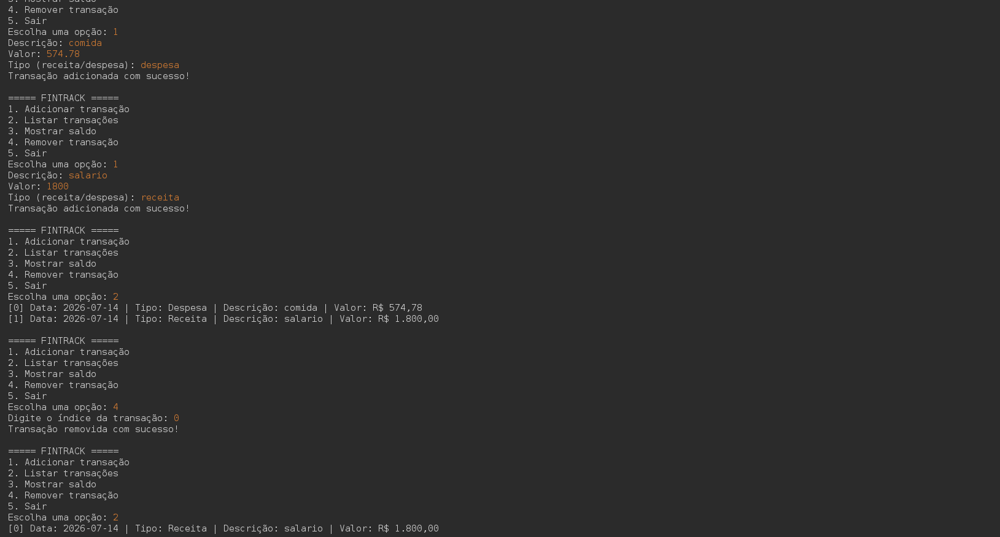

# 💰 FinTrack

Sistema de controle financeiro desenvolvido em **Java** para execução via terminal. O projeto permite cadastrar receitas e despesas, listar transações, calcular o saldo total e remover registros, aplicando conceitos de Programação Orientada a Objetos (POO).

---

## 🚀 Funcionalidades

- ✅ Adicionar receitas
- ✅ Adicionar despesas
- ✅ Listar transações
- ✅ Remover transações
- ✅ Calcular saldo total
- ✅ Validação de entradas
- ✅ Exceções personalizadas
- ✅ Registro automático da data das transações
- ✅ Formatação de valores em Real (R$)

---

## 🛠️ Tecnologias Utilizadas

- Java 25
- Apache NetBeans
- Programação Orientada a Objetos (POO)
- Collections (`ArrayList`)
- LocalDate
- Tratamento de Exceções

---

## 📂 Estrutura do Projeto

```text
FinTrack/
│
├── app/
│   └── Main.java
│
├── controller/
│   └── FinTracker.java
│
├── exceptions/
│   └── EntradaInvalidaException.java
│
├── model/
│   ├── Transacao.java
│   └── TransacaoMensal.java
│
├── utils/
│   └── Formatador.java
│
└── README.md
```

---

## 📸 Demonstração



---

## ▶️ Como Executar

### 1. Clonar o repositório

```bash
git clone https://github.com/Brandoon001/fintrack.git
```

### 2. Abrir o projeto

Abra o projeto no **Apache NetBeans**.

### 3. Executar

Execute a classe:

```text
app.Main
```

---

## 💻 Menu do Sistema

```text
===== FINTRACK =====

1. Adicionar transação
2. Listar transações
3. Mostrar saldo
4. Remover transação
5. Sair
```

---

## 🎯 Objetivo do Projeto

Este projeto foi desenvolvido para praticar:

- Programação Orientada a Objetos
- Encapsulamento
- Herança
- Collections (`ArrayList`)
- Tratamento de exceções
- Manipulação de datas
- Organização de código em pacotes
- Desenvolvimento de aplicações Java para terminal

---

## 🚀 Melhorias Futuras

- Persistência de dados em banco de dados
- Interface gráfica
- Filtro de transações
- Relatórios financeiros
- Integração com Spring Boot

---

## 👨‍💻 Autor

**Antonio Brandoon Costa Silva**

- GitHub: https://github.com/Brandoon001
- LinkedIn: https://www.linkedin.com/in/brandoon-silva-352894215

---

## 📄 Licença

Projeto desenvolvido para fins de estudo.